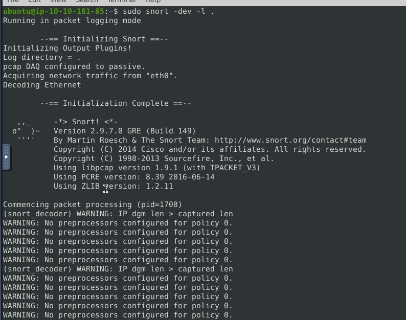
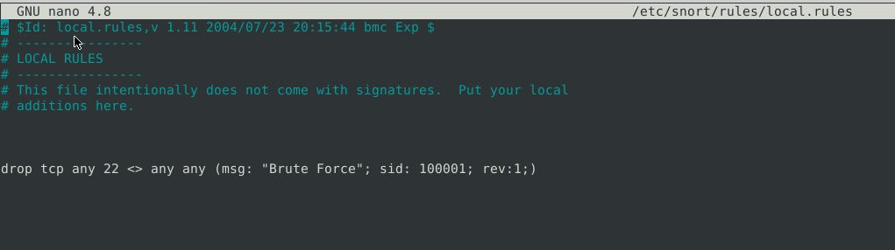
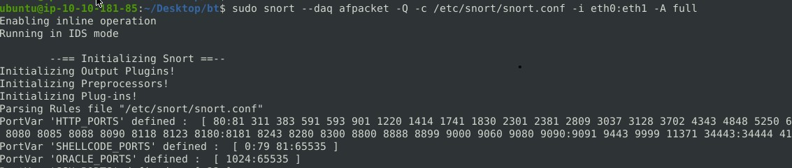
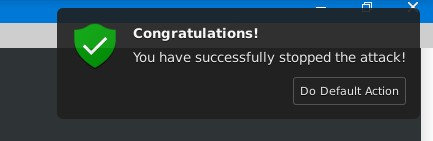
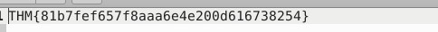
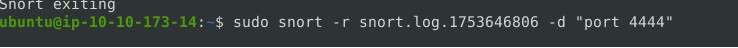
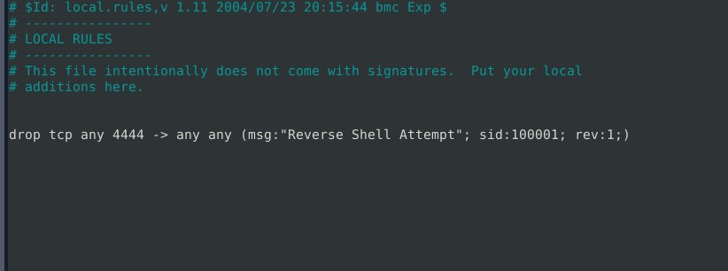
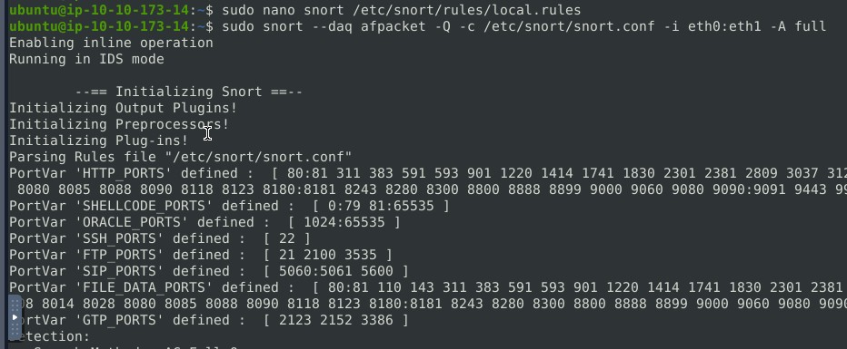
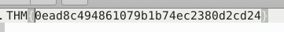

# **Snort Live Attack Detection & Prevention Labs**

## 💑 **Table of Contents**
- [Description](#description)
- [Tools and Technologies Used](#tools-and-technologies-used)
- [Environment](#environment)
- [Lab 1 - SSH Brute Force Attack Detection](#lab-1---ssh-brute-force-attack-detection)
- [Lab 2 - Outbound Reverse Shell Detection](#lab-2---outbound-reverse-shell-detection)
- [Conclusion](#conclusion)

---

## **Description**
These labs simulate real-world attack scenarios using Snort:
1. Detect and stop a brute-force SSH login attempt.
2. Detect and block an outbound reverse shell commonly associated with Metasploit.

---

## **Tools and Technologies Used**
- **Snort 2.9.x**
- **Linux Terminal (Ubuntu-based)**
- **PCAP Log Review & Custom Rule Creation**
- **Inline Network Intrusion Prevention System (IPS) Setup**

---

## **Environment**
- **Operating System**: TryHackMe VM / Ubuntu
- **Network Interfaces**: eth0 (input/sniffer), eth1 (output/firewall)
- **Snort Modes**: Sniffer Mode (`-dev`), Reader Mode (`-r`), Inline Mode (`-Q`)

---

## **Lab 1 - SSH Brute Force Attack Detection**

### **🧪 Step 1: Identify the Attack**

Start Snort in sniffer mode:
```bash
sudo snort -dev -l .
```

Analyze logs:
```bash
sudo snort -r snort.log.<timestamp>
sudo snort -r snort.log.<timestamp> -d "port 80"
sudo snort -r snort.log.<timestamp> -d "port 22"
```

Observation: Unusual amount of traffic on port `22`.



---

### **✍️ Step 2: Write Detection Rule**

Local rule written:
```snort
drop tcp any 22 <> any any (msg: "Brute Force"; sid: 100001; rev:1;)
```



---

### **🛡️ Step 3: Enable Inline Protection**

Enable IPS Mode:
```bash
sudo snort --daq afpacket -Q -c /etc/snort/snort.conf -i eth0:eth1 -A full
```

Attack was successfully blocked and the flag appeared:





**Flag**:
```
THM{81b7fef657f8aaa6e4e200d616738254}
```

---

## **Lab 2 - Outbound Reverse Shell Detection**

### **🧪 Step 1: Detect Suspicious Outbound Traffic**

Traffic was analyzed:
```bash
sudo snort -dev -l .
sudo snort -r snort.log.<timestamp> -d "port 4444"
```

Port `4444` is known to be used in **Metasploit reverse shells**.





---

### **✍️ Step 2: Create Custom Snort Rule**

To block the reverse shell traffic:
```snort
drop tcp any 4444 -> any any (msg:"Reverse Shell Attempt"; sid:100001; rev:1;)
```



---

### **🛡️ Step 3: Run Snort Inline to Block**

Activate the protection:
```bash
sudo snort --daq afpacket -Q -c /etc/snort/snort.conf -i eth0:eth1 -A full
```

Attack blocked → Flag appears.



**Flag**:
```
THM{0ead8c494861079b1b74ec2380d2cd24}
```

---

## ✅ **Conclusion**

This lab demonstrates:
- Live traffic analysis using Snort
- Rule crafting for custom IPS needs
- Identifying brute-force and reverse shell attacks
- Preventing attacks with inline detection

---
